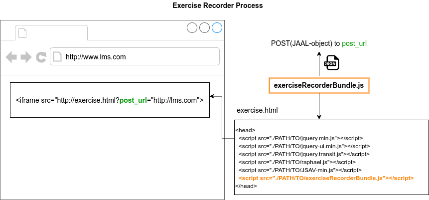

# JSAV Exercise Recorder with New Exercises

## Summary

**JSAV Exercise Recorder** is a JavaScript software for creating recordings of
[JSAV](http://jsav.io)/[OpenDSA](https://github.com/OpenDSA/OpenDSA)
algorithm visualization exercises. The data format for recording the exercises
is [JSON-based Algorithm Animation Language](https://github.com/Aalto-LeTech/JAAL/).

This repository also contains **New JSAV Exercises** which were developed for
teaching and research on Aalto University course *CS-A1141/-43 Data Structures
and Algorithm Y*. This repository has a testbench which allows running each
exercise independently, without OpenDSA or any learning management system, to
develop the exercises and the JSAV Exercise Recorder.

For an easy introduction to the exercises and the Recorder, see the section
*Introduction with testbench*.

## git branches

This repository has the following branches.

`jaal2.0` is the 2022 development branch based on
[JAAL 2.0 rc2 specification](https://github.com/Aalto-LeTech/JAAL/releases/tag/2.0rc1).

`master` is the old development branch.

`traky` is integration work for Data Structures and Algorithms Y (DSA Y) course.
This version of JSAV Exercise recorder does not handle communication with the
A+ LMS. The communication with the LMS is done in the function `n.showGrade()`
in the file
*tools/extras/OpenDSA/lib/odsaAV-min.js* at [DSA Y course repository]
(https://version.aalto.fi/gitlab/course/traky/blob/jaal/tools/extras/OpenDSA/lib/odsaAV-min-commented.js#L759).
The main differences in the JSAV Exercise Recorder between the `master` and
`traky` branches are in the main file *exerciseRecorder.js*:

1. `rest-services/services.js` is not used.
2. `setSubmissionAndPostUrl()` is not used.
3. Exercise recording is accessible globally:
   `global.JSAVrecorder.getRecording()`

## Introduction with testbench

To test the exercises and the Recorder manually, you will need
[https://www.python.org](Python 3) and a web browser. Once you have those,
start the *test bench server* in the directory `testbench`. E.g. in a UNIX
environment:

```bash
cd testbench
./start-server.py
```

Next, open [http://localhost:8000/OpenDSA/AV/Development/](http://localhost:8000/OpenDSA/AV/Development/) at your web browser.
(If needed, you can specify another HTTP port as a parameter, e.g.
`./start-server.py 8001`.) You should see a web page with title
*Directory listing for /OpenDSA/AV/Development/*.

This directory contains the exercise files. Try clicking *graphDFSPE.html*.
That should show a web page like this:


This is just a regular JSAV/OpenDSA exercise.
- You can simulate the algoritm by clicking edges (the lines) in the graph
  view. See the exercise instructions on the top of the exercise.
- *Undo* button undoes your recent action.
- *New Exercise* button gives a new exercise instance.
- *Model Answer* button opens a dialog which shows the model answer as
  a series of pictures and text.
- *Grade* button grades your solution.


You can stop the web server at command line by Ctrl+C.


## Developing JSAV Exercise Recorder 

To compile the software, you will need:

- [Node.js](https://nodejs.org/en/)
- [Python 3](https://www.python.org/)


After you have cloned this git repository:

```
git submodule init
git submodule update
npm install
npm run build
```

## Testing at development

See `testbench/README.md`.


## JAAL

The export data format of the Exercise Recorder is *JSON-based Algorithm
Animation Language* (JAAL). The language is specified in the MSc thesis.
Each JAAL recording (file) contains a student's answer to a JSAV-based
visual algorithm simulation exercise. The main structure of a JAAL recording
is the following.

    {
        "metadata": {} ,
        "definitions": {},
        "initialState": {},
        "animation": [],
    }

JAAL specification and documentation is included as a git submodule in the
directory `validation/JAAL`.

## New designs of JSAV exercises

This repository contains new designs of JSAV exercises.

The exercise code itself is at `Testbench/OpenDSA/AV/Development`.
See `testbench/README.md` for how to start the test bench.

The design documentation of the exercises is at `doc/exercise_design`.

## Source code organisation

The Exercise Recorder is implemented on [Node.js](https://nodejs.org/en/).
A Node.js tool [Browserify](http://browserify.org/) compiles all source code
and required libraries into file *exerciseRecorderBundle.js* which can be
used with a JSAV-based exercise. The following figure represents the source
code modules and the build process.


## How the Exercise Recorder works

When an HTML document containing the Exercise Recorder and the JSAV-based
exercise is loaded, the execution from the source code perspective begins at
file `exerciseRecorder.js`.



The Exercise Recorder initializes automatically when it is imported into an
HTML document. It starts listening for all JSAV log events. For this reason it
is important that the it is imported in the `<head>` element of the HTML
document, before the JSAV exercise is loaded.

Upon initialization the Exercise Recorder will look for the *post\_url* URL
parameter, which should contain the URL where the recorded animation data has to
be posted. Instead of a URL, the *post\_url* can also contain the string
"window", in which case the recorded data will be posted to the window where the
Exercise Recorder has been loaded.


Currently the recorded data is sent to the given *post_url* when the user clicks
the grade button.

## Installation for development with DSA Y

See doc/aplus_integration/aplus_integration.md.

### Running the tests
The tests are written with Jest. To run the tests do t/JSAV-exerciseshis the
`jsav-exercise-recorder` directory:

    npm run test

### Building the bundle file
To bundle all the required modules in one file use [Browserify](http://browserify.org/).

    npm install -g browserify
    npm run build

The DSA Y course repository, branch `traky`, should have a script called
`compile-jaal.sh` which does the rest.

## Literature

The initial version of the software ("JAAL 1.0") was introduced in
[Giacomo Mariani's MSc thesis](https://aaltodoc.aalto.fi/handle/123456789/44448).

For shorter reading, there is a conference article which describes the


